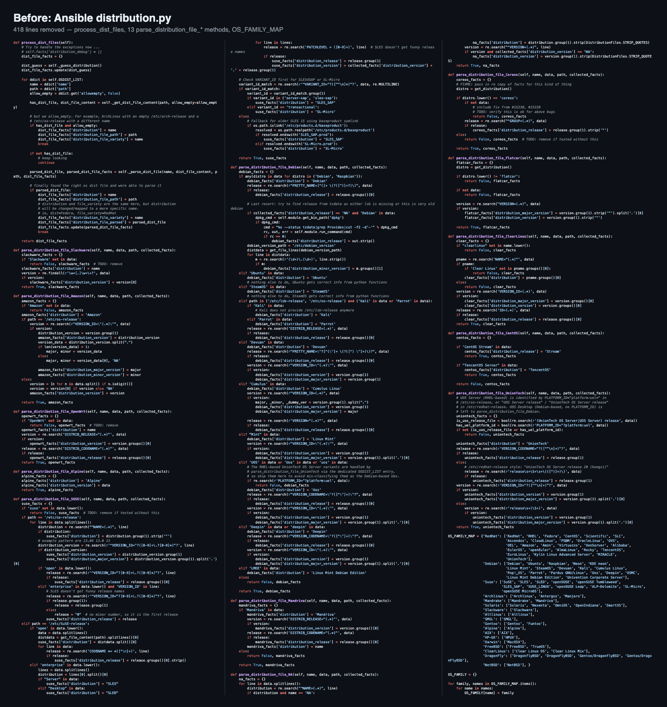
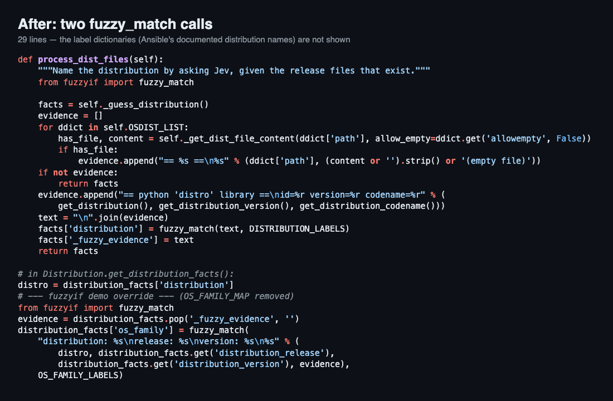

# fuzzyif

**Write the condition of an `if` statement in plain language.**

```python
from fuzzyif import fuzzy

if fuzzy("Is this message urgent?", msg):
    notify_oncall(msg)
```

fuzzyif sends the question and the text to [Jev](https://docs.typesafe.ai), TypeSafe AI's
System One model, and turns the probability it returns into a `bool`. Jev does not
generate text; it only judges. That makes a call fast (about 0.25 s on a warm
connection), cheap (a few hundred input tokens, about 20 output tokens), and
deterministic enough to sit inside control flow.

[](https://pypi.org/project/fuzzyif/)
[](https://github.com/Tdual/fuzzyif/actions/workflows/ci.yml)

- [Install](#install)
- [Quick start](#quick-start)
- [Case study: Ansible](#case-study-ansible-786-lines-of-if-elif--two-questions)
- [API](#api)
- [Testing your code](#testing-your-code)
- [Performance](#performance)
- [Configuration](#configuration)
- [When not to use it](#when-not-to-use-it)

## Install

```bash
pip install fuzzyif
```

Python 3.10 or newer. No runtime dependencies; the HTTP client is the standard library.

You need a TypeSafe API key. fuzzyif looks for it in this order:

1. `fuzzyif.configure(api_key="...")`
2. the environment variable `TYPESAFE_API_KEY`
3. the file `~/.config/typesafe/api_key`

## Quick start

```python
from fuzzyif import fuzzy, prob, fuzzy_match, fuzzy_batch, fuzzy_score

msg = "After I enter my password the screen goes blank."

# yes / no
if fuzzy("Is this a bug report?", msg):
    open_ticket(msg)

# the probability behind it
p = prob("Is this a bug report?", msg)          # 0.0 .. 1.0

# one label out of several, in a single request
kind = fuzzy_match(msg, {
    "bug":   "a bug report",
    "howto": "a how-to question",
    "other": "anything else",
})                                              # "bug"

# several yes/no questions about the same text, in a single request
p_urgent, p_angry = fuzzy_batch(msg, ["Is it urgent?", "Is the writer angry?"])

# a position on an ordered scale (0 = first level)
anger = fuzzy_score(msg, "How angry is the writer?", ["calm", "annoyed", "furious"])   # 0 .. 2
```

### `fuzzy` or `fuzzy_match`?

`fuzzy()` answers each question on its own. Stacking several in `if / elif` is
**not** exclusive: when two questions both cross the threshold, the first branch
wins even if the second is more likely. When you want exactly one of several
labels, use `fuzzy_match()`; it compares all options in one request and returns
the best one.

## Case study: Ansible, 786 lines of `if`/`elif` → two questions

Ansible's `setup` module reports which Linux distribution a host runs. The
decision lives in `lib/ansible/module_utils/facts/system/distribution.py`: walk
a list of release files, match search strings, and dispatch to thirteen
`parse_distribution_file_*` methods, each a ladder of `if`/`elif` on the file
contents. A hand-maintained `OS_FAMILY_MAP` then turns the name into a family.

### Before

`process_dist_files`, the 13 parsers, and `OS_FAMILY_MAP`. Everything in this
picture was deleted.



### After

Two `fuzzy_match` calls. The label dictionaries they read from (the distribution
names Ansible already documents, one line of description each) are not shown.



### Size

| | Before | After |
|---|---|---|
| `distribution.py` | 786 lines | 450 lines |
| `if` / `elif` in the detection code | 84 | 0 |
| parser methods | 13 | 0 |
| name → family table | 70 entries, maintained by hand | none |
| calls to Jev per host | 0 | 2 |

### Ansible's own tests

Ansible ships 90 recorded fixtures: real `/etc/*-release` contents from 52
distributions, each with the facts the collector must report. The test compares
every key.

| Result key | What it is | Agreement |
|---|---|---|
| `distribution` | which of 52 distributions | 90 / 90 |
| `os_family` | RedHat, Debian, Suse, ... | 87 / 88 |
| `distribution_version` | e.g. `15.6` | 88 / 90 |
| `distribution_major_version` | e.g. `15` | 84 / 84 |
| `distribution_cpe_name` | from `os-release` | 20 / 20 |
| `distribution_release` | e.g. `bookworm` | 68 / 88 |
| `distribution_minor_version` | only some parsers set it | 0 / 3 |

| Fixtures | Before | After |
|---|---|---|
| all keys match | 90 | 65 |
| any key differs | 0 | 25 |
| wall time | 0.1 s | 47 s (180 Jev calls, cold cache) |

### What the 25 differences are

26 key mismatches across 25 fixtures. They are not wrong judgements. They are Ansible's string-extraction conventions,
which the fuzzy version deliberately leaves to the `distro` library instead of
re-implementing:

| Key | Count | Convention the deleted parser implemented |
|---|---|---|
| `distribution_release` | 20 | SUSE puts the service-pack number here (`15-SP6` → `6`); openSUSE Leap the minor digit (`15.1` → `1`); Clear Linux the literal `clear-linux-os`; CentOS `Stream`; Devuan the codename from `/etc/devuan_version`; Cumulus the whole `DISTRIB_DESCRIPTION` |
| `distribution_minor_version` | 3 | Debian and Amazon parsers add a key the baseline does not |
| `distribution_version` | 2 | OSMC reads `March 2022` from a custom file; SLES 11.3 takes the patch level from `/etc/SuSE-release` |
| `os_family` | 1 | Ansible labels the same UnionTech OS `Uos` (Debian family) or `UnionTech` (RedHat family) depending on which files exist; the judge picked the other one |

**This is the boundary the case study is meant to show.** fuzzy-if replaces the
`if` ladder that decides *what something is*. It does not replace code that cuts
a substring out of a file. Keep the extraction; delete the judgement.

Everything needed to reproduce the numbers is in
[`examples/ansible_distribution/`](examples/ansible_distribution/).

## API

| Function | Question type | Returns |
|---|---|---|
| `fuzzy(question, text, *, threshold=0.5, default=None)` | yes / no | `bool` |
| `prob(question, text, *, default=None)` | yes / no | `float` in 0..1 |
| `fuzzy_batch(text, questions, *, default=None)` | several yes / no in one request | `list[float]` |
| `fuzzy_match(text, choices, *, default=None, with_probs=False)` | pick one | the chosen key, or `(key, {key: p})` |
| `fuzzy_score(text, question, levels, *, default=None)` | ordered scale | expected index as `float` |
| `configure(**settings)` | | `Settings` |
| `mock(mapping, *, default_prob=None)` | | context manager |

### Errors

An API failure raises `APIError` unless you pass `default=`:

```python
if fuzzy("Is this spam?", msg, default=False):
    ...
```

Be careful with negations. `if not fuzzy(..., default=False)` lets everything
through during an outage.

Bad input raises `ValueError` before any request is made: empty or blank text, a
threshold outside 0..1, fewer than two choices or levels, a `default` that is not
one of the choices.

| Exception | When |
|---|---|
| `ConfigError` | no API key found |
| `APIError` | HTTP 4xx, or 429 / 5xx / network failure after the retries; has `status_code`, `body`, `attempts` |
| `MockMissError` | a question inside `mock()` that the mapping does not cover |

## Testing your code

`mock()` answers from a mapping instead of calling the API. The cache is
bypassed while it is active. Values can be a number, a `{text: value}` dict, or
a callable.

```python
import fuzzyif

with fuzzyif.mock({
    "Is this message urgent?": {"server down": 0.95, "team dinner": 0.1},
    "bug|howto|other": lambda text: "bug" if "error" in text else "other",
}):
    run_my_code()
```

The mock key for `fuzzy_match` is the sorted choice keys joined with `|`. A
question with no entry raises `MockMissError`, so a test cannot silently pass on
a question you forgot to stub; pass `default_prob=` to relax that.

## Performance

- One keep-alive HTTPS connection per thread. The first call pays for TCP and TLS
  (about 0.6 s); later calls take about 0.25 s.
- An LRU cache in front of every call (`cache_size`, default 1024). The same
  question and text never reach the API twice. A cache hit costs microseconds.
- `fuzzy_batch` and `fuzzy_match` make one request for several judgements.
- Retries with backoff on 429 and 5xx (`max_retries`, default 3); `Retry-After`
  is honoured. A dropped connection is reopened once without counting as a retry.
- Request bodies are UTF-8, so non-Latin text works.

## Configuration

```python
fuzzyif.configure(
    api_key=None,                      # overrides the env var and the key file
    model="jev-latest",
    timeout=10.0,                      # seconds per HTTP request
    cache_size=1024,                   # 0 disables the cache
    max_retries=3,
    base_url="https://api.typesafe.ai",
)
```

`configure()` clears the cache and drops the HTTP connection. The cache key
includes the model, so switching models never returns stale answers.

## When not to use it

- **Anything you would not send to a third party.** The text goes to the API.
  Passwords, personal data, and confidential documents do not belong in a
  `fuzzy()` call.
- **Extraction.** "Which version string is in this file?" is not a judgement.
  Use a regex, or `fuzzy_match` over candidates you extracted yourself.
- **Hard guarantees.** Jev is stable on identical input, but a borderline case
  (p near 0.5) can move between runs. Do not put a security decision behind a
  threshold.
- **Tight loops over large data.** Every distinct text is a network call. Batch
  what you can and let the cache do the rest.

## License

MIT.
